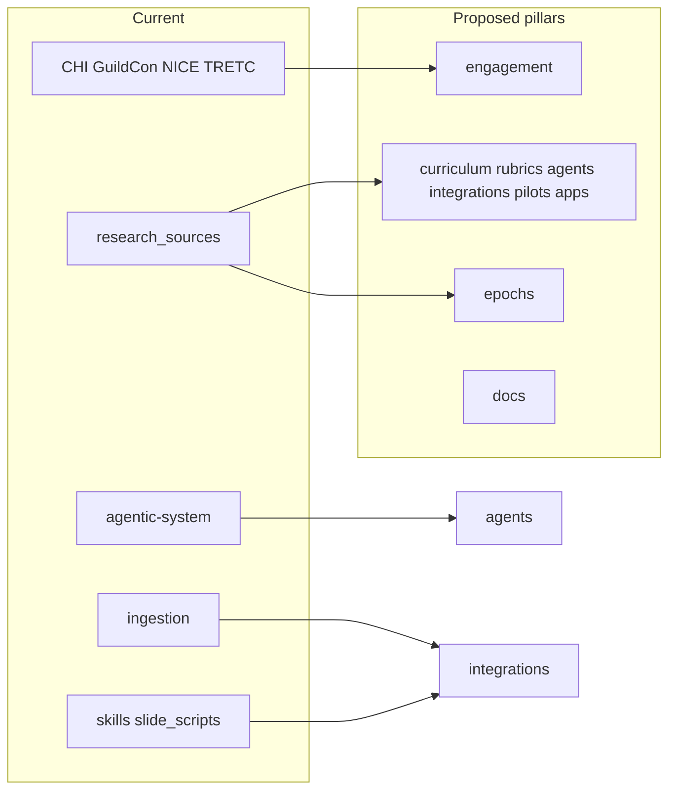

# Migration map section for REVISION_MODEL.md

## Context

[REVISION_MODEL.md](/Users/zak/src/learning-economies/REVISION_MODEL.md) already defines **three objectives**, **documentation layout**, and **proposed** top-level folders (`engagement/`, `curriculum/`, `rubrics/`, `agents/`, `integrations/`, `pilots/`, optional `applications/`, `epochs/`, root `docs/`). The repo today is organized differently.

**Current top-level directories** (excluding `.git`, `.cursor`): `agentic-system/`, `CHI-2026/`, `GuildCon-2025/`, `ingestion/`, `NICE-2026/`, `research_sources/`, `skills/`, `slide_scripts/`, `TRETC_2026/`.

**Root markdown** (examples referenced by [README.md](/Users/zak/src/learning-economies/README.md)): main theory paper (`2025-09-14-AI-learning-economics.md`), `NIST-800-181-testable-templates.md`, `learning-economies-service-demo.md`, `hypothesis-structure-design.md`, `llm-architecture-principles-framework.md`, `learning-economy-3-subsets.md`, `ingest_URLS.md`, `REVISION_MODEL.md`, etc.

**Submodule** (from [.gitmodules](/Users/zak/src/learning-economies/.gitmodules)): `research_sources/The-Art-Of-Language` — any path change under `research_sources/` must preserve `.gitmodules` paths or be updated in the same migration commit.

## What to add in REVISION_MODEL.md

Insert a new `**## Migration map (current → proposed)**` section **after** [Proposed repository structure](#) (or immediately before **Implementation Checklist**) so readers see target layout first, then concrete “from → to” guidance.

Recommended subsections:

### 1. Direct folder moves (one-to-one or rename-in-place)

Document moves with **source → destination** and **pillar**. Example rows to include:

| Source            | Proposed destination                                                                        | Rationale (one line)                                                                                                                           |
| ----------------- | ------------------------------------------------------------------------------------------- | ---------------------------------------------------------------------------------------------------------------------------------------------- |
| `CHI-2026/`       | `engagement/conferences/chi-2026/` (or `engagement/CHI-2026/`)                              | Conference decks and build scripts                                                                                                             |
| `GuildCon-2025/`  | `engagement/conferences/guildcon-2025/`                                                     | Same                                                                                                                                           |
| `NICE-2026/`      | `engagement/conferences/nice-2026/`                                                         | Same                                                                                                                                           |
| `TRETC_2026/`     | `engagement/conferences/tretc-2026/`                                                        | Presentation materials ([TRETC_2026/README.md](/Users/zak/src/learning-economies/TRETC_2026/README.md))                                        |
| `agentic-system/` | `agents/examples/` or `agents/teaching-goals/` (pick one naming convention)                 | Agent prompts, multi-agent notebook per [agentic-system/README.md](/Users/zak/src/learning-economies/agentic-system/README.md)                 |
| `ingestion/`      | `integrations/ingestion/` (or `integrations/captures/`)                                     | Link/capture notes for research ingestion ([ingestion/this-is-a-link-to.md](/Users/zak/src/learning-economies/ingestion/this-is-a-link-to.md)) |
| `slide_scripts/`  | `integrations/slide-scripts/`                                                               | Pandoc/slide tooling ([slide_scripts/](/Users/zak/src/learning-economies/slide_scripts/))                                                      |
| `skills/pptx/`    | `integrations/skills/pptx/` **or** keep `skills/pptx/` with README pointing to integrations | Vendored Anthropic pptx skill; [README.md](/Users/zak/src/learning-economies/README.md) references paths                                       |

**Note:** The plan document should use **bullet lists**, not tables, when written into the user-facing plan file if tables are discouraged—but the actual REVISION_MODEL.md section *can* use a markdown table for scannability (user preference). I'll recommend a **table in REVISION_MODEL** for the migration map (easy to scan).

### 2. Split: `research_sources/`

This tree is the largest migration decision. Propose a **default split** with an explicit “review” callout:

- `**research_sources/curriculum/`** → `**curriculum/research/`** (or `curriculum/sources/`) — program writeups, scraping guides, AGENT-PROMPT-TEMPLATE (or move template to `agents/`).
- `**research_sources/careers/**` → `**curriculum/careers/**` or `**curriculum/pathways/**` — roadmap/career breadth material aligned with “breadth” economy.
- `**research_sources/case_studies/**` → `**curriculum/case-studies/**` or `**pilots/case-studies/**` depending on whether content is reference vs experiment design.
- **Event-style markdown at `research_sources/` root** (e.g. `AIME-Con CMU 2025.md`, `Pittsburgh_Tech_Week_2025_AI_Education.md`) → `**engagement/events/`** or under `engagement/` with a flat `notes/` subfolder.
- `**research_sources/Anki_Cybersecurity_flash_cards/`** — split judgment: learning artifacts → `**curriculum/**` or `**epochs/**` if treated as run outputs/journals; document both options briefly.
- **Heavy QA / translation pipelines** (e.g. under `research_sources/curriculum/Xinjiang Police College/qa/`) → `**epochs/`** (outputs, scripts, schemas) vs keeping under `**curriculum/`** if framed as source research only; recommend `**epochs/**` for reproducible analysis artifacts and `**curriculum/**` for published summaries only.

**Submodule:** `research_sources/The-Art-Of-Language` — either **leave path as-is** until a dedicated submodule migration, or move to `curriculum/third-party/the-art-of-language` **and** update `.gitmodules` + gitlink in one change. The new section should state: **do not move submodule directories without updating `.gitmodules`.**

### 3. Root-level markdown

Bullet map for common files:

- Core theory / framework docs → `**curriculum/`** (canonical “source of truth”) or `**docs/`** if treated as repo-wide narrative only; recommend `**curriculum/framework/**` for the main paper and related subset docs.
- `NIST-800-181-testable-templates.md`, hypothesis templates → `**pilots/**` (and cross-link from `curriculum/` README if needed).
- `learning-economies-service-demo.md` → `**docs/**` (architecture) or `**applications/**` if paired with code later.
- `ingest_URLS.md` → `**docs/**` or `**integrations/**`; link from root README.
- `REVISION_MODEL.md` → stay at root (per current doc) or note optional move to `**docs/**`.

### 4. New folders with no current direct equivalent

Call out **greenfield** targets: `rubrics/`, empty `epochs/` layout, root `**docs/`** — no migration source; scaffold per checklist.

### 5. Post-migration follow-ups (short checklist in the same section)

- Update internal links in [README.md](/Users/zak/src/learning-economies/README.md) and conference READMEs (e.g. CHI pptx build paths).
- Run a quick `rg`/link check for broken relative paths.
- Prefer `**git mv`** to preserve history.

## File to change

- Single file: [REVISION_MODEL.md](/Users/zak/src/learning-economies/REVISION_MODEL.md) — add the section; optionally add one line in **Implementation Checklist** pointing to **Migration map** for ordering work (e.g. “Follow Migration map before bulk moves”).

## Out of scope for this task

- Actually moving files or creating directories (user only asked to add the **section** to the model doc).
- Resolving ambiguous splits definitively without user preference (the section should label **TBD** items where two pillars are plausible).

