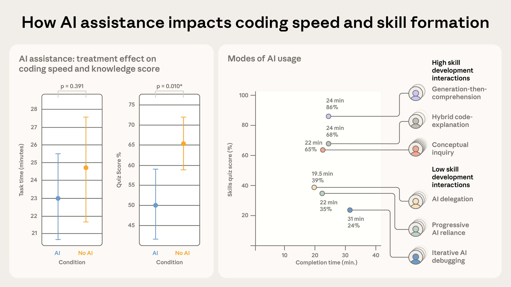

# AI Assistance Impacts on Coding Skill Formation - Learning Economy Implications

Ingestion Date: 2026-02-06
Source: https://www.anthropic.com/research/AI-assistance-coding-skills
Paper: https://arxiv.org/abs/2601.20245
Authors: Judy Hanwen Shen, Alex Tamkin (Anthropic)
Published: January 29, 2026

---

## Summary of Study

Anthropic conducted a randomized controlled trial with 52 (mostly junior) software engineers to measure how AI coding assistance affects both task completion speed and knowledge retention. Participants were tasked with learning the Trio Python library (asynchronous programming) — half with AI assistance, half coding by hand.

### Key Findings

- **AI group scored 17% lower** on a post-task quiz (50% vs 67%, p=0.010) — nearly two letter grades
- **Task completion speed difference was not statistically significant** (p=0.391) — AI users were only ~2 minutes faster
- **Debugging skills showed the largest gap** between AI and non-AI groups — the ability to identify when code is incorrect and why it fails was most impaired by AI assistance
- Several AI participants spent up to 11 minutes (30% of allotted time) composing up to 15 queries, which offset potential speed gains



---

## Modes of AI Usage and Their Outcomes

The study's qualitative analysis identified six distinct interaction patterns, split into two tiers:

### Low Skill Development Interactions (avg quiz scores < 40%)

1. **AI Delegation** (n=4): Wholly relied on AI to write code. Fastest completion but lowest learning.
2. **Progressive AI Reliance** (n=4): Started independently but eventually delegated everything to AI. Failed to master second-task concepts.
3. **Iterative AI Debugging** (n=4): Used AI to debug/verify code. Asked more questions but relied on AI to solve problems rather than clarify understanding. Scored poorly AND were slower.

### High Skill Development Interactions (avg quiz scores >= 65%)

1. **Generation-then-Comprehension** (n=2): Generated code with AI, then asked follow-up questions to build understanding. Nearly identical workflow to AI Delegation except for the comprehension step.
2. **Hybrid Code-Explanation** (n=3): Composed queries requesting both code generation AND explanations. Took more time but showed stronger comprehension.
3. **Conceptual Inquiry** (n=7): Only asked conceptual questions, coded independently based on improved understanding. Encountered many errors but resolved them independently. **Fastest among high-scoring patterns and second fastest overall, after AI delegation.**

---

## Implications for the Learning Economy Model

This study reinforces the poop-fest that is AI debugging. Basically it makes you dumber, in that regard. The iterative AI debugging pattern is the worst of both worlds: participants scored poorly AND were slower at completing tasks. It also implicitly recognizes that humans should not be interacting with AI in the debugging loop, in the way that AI solves it today.

But also — debugging support from AI can, and should, be done as in the upper parts of the chart: edifying and exploring new effective learning. When you do things in the ways of the upper parts of the chart, AI helps you get smarter faster. The generation-then-comprehension and hybrid code-explanation patterns demonstrate that AI can accelerate skill formation when the interaction is oriented toward understanding rather than task completion.

### Specific Learning Economy Value Proposition

The learning economy system has a specific pickle value by avoiding the risk of this debugging pattern and other AI usages that reduce learning potentials and outcomes. This means:

1. **Measurable Risk of AI-Mediated Skill Atrophy**: The 17% score reduction provides a concrete quantification of skill formation loss from naive AI usage. A learning economy system that routes interactions toward high-skill-development patterns could preserve or accelerate this delta instead.

2. **Debugging as the Critical Vulnerability**: The largest gap was in debugging skills — precisely the capability most needed for human oversight of AI-generated code. A learning economy framework should specifically flag debugging-delegation as a high-cost cognitive offloading pattern and route learners toward conceptual inquiry or generation-then-comprehension patterns instead.

3. **The Conceptual Inquiry Sweet Spot**: The conceptual inquiry mode (n=7) was the most populated high-scoring cluster, was the fastest among high-scoring patterns, AND produced strong learning outcomes. This suggests that a learning economy system optimizing for both efficiency and skill development should bias toward this interaction pattern — where AI serves as a conceptual guide while the human retains implementation agency.

4. **Differential Value of AI Interaction Modes**: The difference between "AI delegation" and "generation-then-comprehension" is a single behavioral step (asking follow-up questions for understanding). This tiny marginal cost in time produces a massive difference in learning outcome. A learning economy system that nudges users across this threshold captures enormous value at near-zero cost.

5. **Cognitive Effort as Investment, Not Cost**: The study's finding that "cognitive effort — and even getting painfully stuck — is likely important for fostering mastery" directly maps to the learning economy principle that productive struggle has a positive expected return on cognitive capital investment.

### Connection to Existing Learning Economy Architecture

- The **spaced repetition / Anki integration** discussed for keystoneflow-gravity becomes more critical here: if AI usage erodes immediate retention, spaced repetition systems could serve as a compensatory mechanism
- The **vision-critic-guardian modeling pattern** maps to the high-skill interaction modes: vision (generation), critic (comprehension/explanation), guardian (conceptual inquiry maintaining learning integrity)
- This provides empirical grounding for why learning economy metrics should track not just task throughput but skill formation rate and retention quality

---

## Cross-References

- [learning-platforms.md](learning-platforms.md) — Math Academy's adaptive learning and mastery-based progression relate to the "conceptual inquiry" pattern
- Relevant to the CHI-2026 paper and conference work on learning economies
- Connects to NIST-800-181 testable templates for measuring skill acquisition

## Citation

```bibtex
@misc{aiskillformation2026,
  author = {Shen, Judy Hanwen and Tamkin, Alex},
  title = {How AI Impacts Skill Formation},
  year = {2026},
  eprint = {2601.20245},
  archivePrefix = {arXiv},
  primaryClass = {cs.LG},
  eprinttype = {arxiv}
}
```

## Action Items

- [ ] Quantify the "pickle value" — model the economic delta between high-skill and low-skill AI interaction patterns
- [ ] Design a learning economy intervention that nudges users from AI delegation toward generation-then-comprehension (the minimal behavioral shift with maximum learning ROI)
- [ ] Investigate whether the debugging skill gap can be specifically addressed through structured AI-guided conceptual debugging (not solution debugging)
- [ ] Cross-reference with NIST-800-181 to see if debugging competency maps to specific workforce framework KSAs
- [ ] Consider this study as supporting evidence for CHI-2026 paper arguments about reflective learning loops
