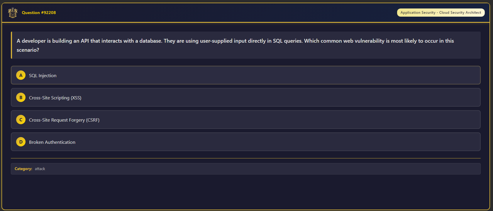

<p align="center">
  
</p>

# The Art Of Language

   

> "Every new creation is a mirrored reflection of the last but with a twist."

---

## Vision

This repository represents the **completion of a trilogy**—a journey that began with learning languages and evolved into understanding learning itself as a language.

**The Trilogy**:
1. **[Language Learning Journey](https://github.com/RexRenatus/Language-Learning-Journey)** - The foundation: systematic acquisition of human languages
2. **[Continuous Improvement](https://github.com/RexRenatus/Continuous-Improvement)** - The evolution: treating all mastery as language acquisition
3. **The Art Of Language** - The synthesis: the philosophy and art behind it all

The number **3** is symbolic of completion. This **3rd** repository serves as the philosophical cornerstone, synthesizing insights from the journey and pointing the way forward.

---

## Philosophy

### The Gift of Vision

During this journey of Learning As A Language, a realization emerged: **ignorance is truly bliss**—but vision is a gift meant to be shared.

Why document this journey? Why share these findings? The answer is simple:

> "I do this because I know that others may not know, and I see what they may not see. So I will continue to point the way."

The seeds planted today may grow into ideas that push the boundaries of modern philosophy. Not everyone who discovers these repositories may be ready—but for those who are willing to **walk through the fire and emerge on the other side**, this knowledge awaits.

### Core Beliefs

- **Words begat thought**
- **Thought begat action**
- **Action begat creation**

The brain was given a blueprint but no tools. **Knowledge is the tool.** Through the acquisition of knowledge, the blueprint activates, and creation is left to the **IMAGINATION**.

---

## What's New

### 2025-12-25: Cybersecurity Flashcard Collection

**152,874 flashcards** spanning 17 security domains released. See [Anki_Cybersecurity](Anki/Anki_Cybersecurity/README.md) for details.

**Download Anki Package**: [Proton Drive](https://drive.proton.me/urls/ZS8R3YKFPC#aPpiZSIHqiyX)

**Preview:**




### 2025-12-21: Repository Inception

**The Art Of Language** is born—completing the trilogy and establishing a new space for philosophical synthesis and continued reflection.

---

## Repository Structure

```
The-Art-Of-Language/
├── Anki/                         → Learning resources
│   └── Anki_Cybersecurity/       → 152,874 security flashcards
│
├── Journal/                      → Philosophical reflections and insights
│   └── 2025/
│       └── 12/
│           ├── 20251221.md       → Inaugural entry
│           └── 20251225.md       → Christmas entry
│
└── README.md                     → This file
```

---

## The Journey So Far

| Repository | Purpose | Status |
|-----------|---------|--------|
| Language Learning Journey | Human language acquisition | Active |
| Continuous Improvement | Skill mastery as language | Active |
| **The Art Of Language** | Philosophical synthesis | **New** |

---

## Quick Links

### Related Repositories
- [Language Learning Journey](https://github.com/RexRenatus/Language-Learning-Journey) - Where it all began
- [Continuous Improvement](https://github.com/RexRenatus/Continuous-Improvement) - Learning as a Language philosophy

### Journal Entries
- [Christmas Reflection (2025-12-25)](Journal/2025/12/20251225.md) - Cybersecurity flashcards release
- [Inaugural Reflection (2025-12-21)](Journal/2025/12/20251221.md) - The vision and purpose

---

## Philosophy in Practice

This repository embodies:
- **Vision** - Seeing what others cannot yet see
- **Guidance** - Pointing the way for those ready to learn
- **Synthesis** - Connecting insights across the trilogy
- **Completion** - The symbolic power of three

> "Potential is only contained by the limits of the imagination."

---

## Contributing

This is a personal philosophical journey, but I welcome:
- **Dialogue** on the nature of learning and language
- **Insights** that push boundaries
- **Questions** from those willing to walk through the fire

Feel free to open an issue or reach out.

---

**Last updated**: 2025-12-25
**Timezone**: Asia/Seoul (UTC+9)
**Status**: Active - Inception phase
